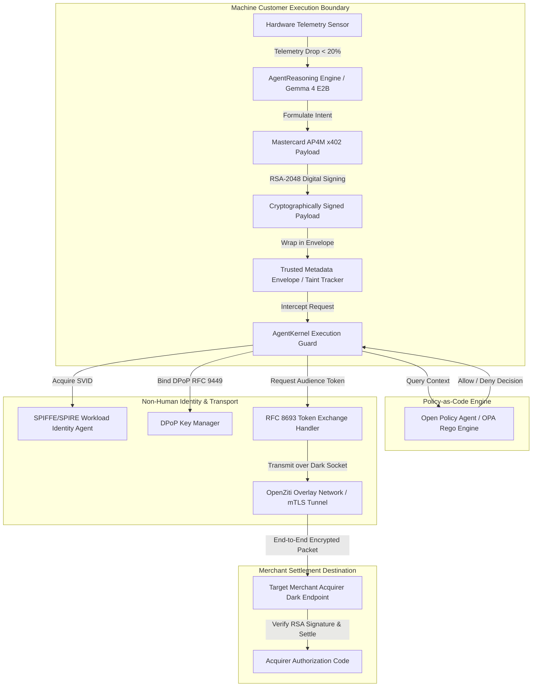

# Zero Trust Machine Customer (NHI & M2M Architectural Blueprint)

## Architectural Paradigm

The **Zero Trust Machine Customer** platform implements an autonomous edge AI agent operating as a Non-Human Identity (NHI) under strict **NIST SP 800-207** (Zero Trust Architecture) and **NIST SP 800-204** (Microservice Security) frameworks.

Unlike standard API clients, the Machine Customer executes financial transactions and tool invocations through multi-layered cryptographic validation, dynamic policy enforcement, and dark-host overlay routing.

---

## Technical Security Matrix

---

## Security Enforcement Layer Details

### 1. Non-Human Identity (NHI) & RFC 8693 Delegation Chains
- **Actor Claim (`act`) Propagation**: Preserves full audit lineage across delegated entity chains (`Human Owner -> Machine Agent -> Merchant API`).
- **PKCE Verifier Lifecycle**: Code verifiers exist exclusively in ephemeral memory and are destroyed immediately upon token exchange completion.

### 2. Demonstrating Proof-of-Possession (DPoP - RFC 9449)
- Outbound requests are bound to the localized runtime key pair using DPoP signatures (`htm`, `htu`, `jti`, `iat`, `ath`), neutralizing token theft risks.

### 3. SPIFFE/SPIRE Workload Identity (NIST SP 800-204)
- Attests workload identity at startup, retrieving X.509 SVID documents (`spiffe://zero-trust.machine.customer/workload/machine-customer-agent`) to establish mTLS transport channels.

### 4. Dynamic Authorization via Policy-as-Code (OPA / Rego)
- Every transaction is evaluated against explicit Rego rules (`src/infrastructure/authorization/policies/machine_customer.rego`), verifying daily spending limits, merchant allowlists, and taint state.

### 5. OWASP Agentic Top 10 Prompt Injection Defense
- Wraps untrusted inputs in `Trusted Metadata Envelopes`. Tainted data triggers a Human-in-the-Loop (HITL) pause requirement prior to executing high-risk financial tools.

### 6. OpenZiti Zero Trust Overlay Mesh
- Routes settlement payloads across dark host overlays with zero open ingress ports, preventing external network scanning and unauthorized target access.
