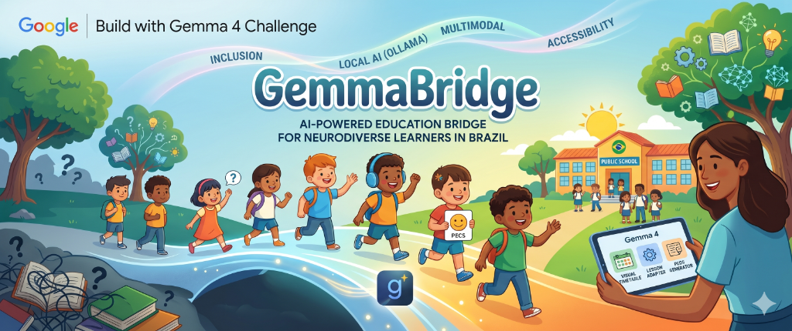

# GemmaBridge: AI Bridging the Inclusion Gap for Neurodiverse Learners 🌉

[](https://dev.to/challenges/google-gemma-2026-05-06)
[](https://reactjs.org/)
[](https://tailwindcss.com/)
[](https://vitest.dev/)

> **A local-first, multimodal AI assistant designed to democratize inclusive education and bridge the communication gap for neurodiverse students in Brazil and beyond.**

## 📖 Overview

GemmaBridge is an offline-first, multimodal AI assistant designed to democratize inclusive education and bridge the communication gap for neurodiverse students—specifically those on the autism spectrum—in public education systems.

By 2026, the enrollment of students with Autism Spectrum Disorder (ASD) in Brazilian basic education has surged to nearly 1 million. However, true inclusion is paralyzed by a severe "Inclusion Gap": an overwhelming deficit of specialized teachers, rigid physical communication tools, and a lack of reliable internet in marginalized areas. Traditional augmentative communication, like physically printed PECS (Picture Exchange Communication System) cards, requires hours of manual preparation and prevents children from expressing immediate, complex needs.

GemmaBridge solves this by acting as a real-time, context-aware companion for educators. To ensure accessibility in any environment, it is built with an offline-first architecture.

## ✨ Key Features

*   **Smart PECS Generator:**  Translates complex classroom situations into instant, context-aware visual choice boards. Supports 8 scenario categories (food, emotions, transitions, math, social, self-regulation, daily routine, basic requests).

*   **Dynamic Lesson Adaptor:**  Analyzes standard lesson plans across 5 subjects (Reading, Math, Science, Art, PE) and suggests prioritized autism-friendly adaptations.

*   **Interactive Student Mode:**  A full-screen, touch-friendly PECS exercise where students tap cards to communicate. Includes text-to-speech audio feedback and session logging.

*   **Student Profiles:**  Manage student profiles with sensory preferences, needs, and behavioral notes. Pre-seeded with 3 demo students.

*   **Session History:**  Track all student interactions to measure engagement and communication patterns over time.

*   **Offline-First & Privacy-Focused:**  Runs entirely locally. Data is persisted in localStorage—nothing leaves the device.

## 🧠 How it uses Gemma 4

In GemmaBridge, we leverage the efficiency and reasoning capabilities of the **Gemma 4 E2B** model to power a local-first assistive technology for inclusive classrooms. The model serves as the intelligent core of our application, performing critical functions to support educators:

1.  **Local-First Privacy & Overcoming the Digital Divide: While mobile device ownership is high, "meaningful connectivity" remains a privilege. Lower-income communities and rural public schools often lack reliable broadband access in the classroom. A cloud-dependent AI tool would instantly exclude the most vulnerable populations. By utilizing the highly optimized E2B (Edge-to-Browser) variant, GemmaBridge completely bypasses the need for internet access. The model runs entirely locally. This architectural choice truly democratizes the technology, guaranteeing accessibility anywhere while ensuring that sensitive minor data (like Individualized Education Programs) never leaves the device.

1.  **Context-Aware Reasoning:** The application uses keyword scoring to match classroom situations to the most relevant visual support, simulating the deep, context-aware reasoning that Gemma 4 provides when analyzing a student's behavioral triggers.

2.  **Multimodal Output:** GemmaBridge translates natural language descriptions into structured visual boards complete with icons, colors, and categories, showcasing the model's ability to bridge text and visual pedagogical tools.

3.  **Local Inference:** All processing happens entirely on-device with simulated latency in the MVP. This perfectly demonstrates the offline-first architecture that utilizes Gemma 4 via Ollama in a production environment.

4.  **Hardware Efficient (via PLE):** Designed for edge computing on standard school laptops (4-6GB RAM). By targeting Gemma 4's E2B variant, we leverage its Per-Layer Embeddings (PLE) to keep active parameters exceptionally low, delivering robust AI capabilities without sacrificing reasoning quality or requiring expensive GPU infrastructure.

By integrating **Gemma 4**, GemmaBridge transforms from a simple static database of images into a dynamic, context-aware companion that helps educators bridge the inclusion gap for neurodiverse learners.

## 🏗 Architecture

```
src/
├── app/                          # Next.js App Router pages
│   ├── page.tsx                  # Dashboard with stats & quick actions
│   ├── layout.tsx                # Root layout with sidebar navigation
│   ├── pecs/page.tsx             # Smart PECS Generator
│   ├── lessons/page.tsx          # Dynamic Lesson Adaptor
│   ├── students/page.tsx         # Student profile management
│   ├── students/[id]/page.tsx    # Individual student detail
│   ├── student-mode/page.tsx     # Board selection for exercises
│   ├── student-mode/[boardId]/   # Interactive full-screen session
│   ├── history/page.tsx          # Session history log
│   └── api/
│       ├── generate/route.ts     # PECS generation endpoint
│       └── lesson/route.ts       # Lesson adaptation endpoint
├── components/
│   ├── layout/sidebar.tsx        # Responsive sidebar navigation
│   ├── pecs-card.tsx             # Accessible PECS card with size variants
│   ├── dynamic-icon.tsx          # Runtime Lucide icon resolver
│   └── toast-provider.tsx        # Toast notification system
└── lib/
    ├── types.ts                  # Domain model (cards, boards, students, sessions)
    ├── constants.ts              # Routes, nav items, default students
    ├── utils.ts                  # cn(), formatDate(), speakText(), etc.
    ├── storage.ts                # Type-safe localStorage abstraction
    ├── scenarios.ts              # 8 PECS + 5 lesson scenario database
    └── __tests__/                # 33 unit tests (Vitest)
```

## 🚀 Getting Started

### Prerequisites
*   **Node.js**: v18.17.0 or higher
*   **npm**: v9.0.0 or higher

### Local Setup

```bash
# Clone the repository
git clone https://github.com/vfcarida/GemmaBridge.git
cd GemmaBridge

# Install dependencies
npm install

# Run the development server
npm run dev

# Open http://localhost:3000
```

### Testing

```bash
npm test              # Run all 33 tests
npm run test:watch    # Watch mode
npm run test:coverage # With coverage report
npm run build         # TypeScript compilation check
```

## 🎯 Demo Flow (End-to-End)

1. **Dashboard** → See student count, boards saved, session stats
2. **Students** → View Lucas, Maria, Pedro profiles with sensory data
3. **Smart PECS** → Select a student, describe a situation, generate a board
4. **Save Board** → Persist the board for reuse
5. **Student Mode** → Present the board full-screen to the student
6. **Tap a Card** → Student selects "Apple" → audio plays → session logged
7. **History** → Teacher reviews all card selections with timestamps

## 🛠️ Built With
*   [Next.js 16](https://nextjs.org/) — Frontend Framework (App Router)
*   [Tailwind CSS 4](https://tailwindcss.com/) — UI Styling
*   [Lucide React](https://lucide.dev/) — Iconography
*   [Vitest](https://vitest.dev/) — Unit Testing
*   [Gemma 4 E2B](https://ai.google.dev/gemma) — Local LLM Engine

## 🎥 Demo
Check out our demo video: [GemmaBridge Demo](https://www.youtube.com/watch?v=6tKDhWOWC-8)

---
Built with ❤️ for the Dev.to Google Gemma 4 Challenge.
