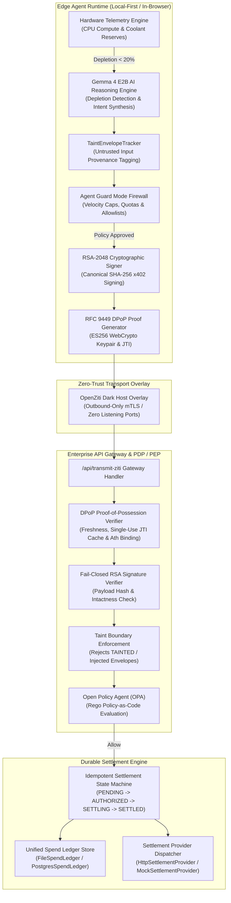
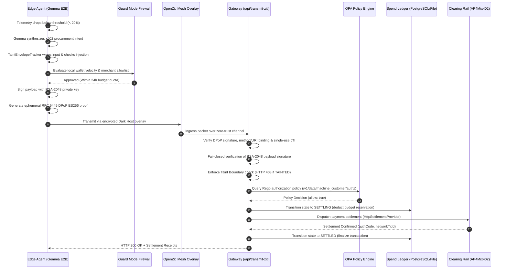

# Zero-Trust Machine Customer 🤖🔒

> [!NOTE]
> **Operational Status**: Production-grade architectural simulation and educational testbed for **Autonomous AI Machine Customers** operating under **Zero Trust Architecture (ZTA, NIST SP 800-207)**, **Microservices Security (NIST SP 800-204A)**, and **Non-Human Identity (NHI)** governance.

[](https://github.com/vfcarida/zero-trust-machine-customer/actions)
[](https://opensource.org/licenses/MIT)
[](https://csrc.nist.gov/publications/detail/sp/800-207/final)
[-red)](https://owasp.org/)
[](https://www.typescriptlang.org/)
[](https://nextjs.org/)

---

## 🎯 Executive Overview

Autonomous AI agents acting as **Machine Customers** represent a fundamental paradigm shift: machines executing autonomous commercial transactions, ordering infrastructure, procuring computational quotas, and negotiating resource replenishment without human-in-the-loop intervention. 

Unrestricted autonomous agents introduce critical attack surfaces:
* **Prompt Injection & Indirect Jailbreaks** (OWASP LLM01 / Agentic ASI-01)
* **Wallet Exhaustion & Excessive Agency** (OWASP LLM06 / Agentic ASI-02)
* **Credential & Proof Theft / Replay Attacks** (RFC 9449)
* **Network Egress Exposure & Perimeter Infiltration** (NIST SP 800-207)

The **Zero-Trust Machine Customer** platform provides a hardened, local-first reference architecture and interactive visual simulator demonstrating how to enforce cryptographic zero-trust guardrails across the entire autonomous procurement lifecycle.

---

## 📐 System Architecture & Flow


```mermaid
flowchart TD
    subgraph EdgeDevice ["Edge Agent Runtime (Local-First / In-Browser)"]
        Telemetry["Hardware Telemetry Engine\n(CPU Compute & Coolant Reserves)"]
        GemmaEngine["Gemma 4 E2B AI Reasoning Engine\n(Depletion Detection & Intent Synthesis)"]
        TaintTracker["TaintEnvelopeTracker\n(Untrusted Input Provenance Tagging)"]
        GuardMode["Agent Guard Mode Firewall\n(Velocity Caps, Quotas & Allowlists)"]
        Signer["RSA-2048 Cryptographic Signer\n(Canonical SHA-256 x402 Signing)"]
        DPoPMint["RFC 9449 DPoP Proof Generator\n(ES256 WebCrypto Keypair & JTI)"]
    end

    subgraph TransportMesh ["Zero-Trust Transport Overlay"]
        ZitiOverlay["OpenZiti Dark Host Overlay\n(Outbound-Only mTLS / Zero Listening Ports)"]
    end

    subgraph EnterpriseGateway ["Enterprise API Gateway & PDP / PEP"]
        GatewayRoute["/api/transmit-ziti Gateway Handler"]
        DPoPVerifier["DPoP Proof-of-Possession Verifier\n(Freshness, Single-Use JTI Cache & Ath Binding)"]
        SigVerifier["Fail-Closed RSA Signature Verifier\n(Payload Hash & Intactness Check)"]
        TaintBoundary["Taint Boundary Enforcement\n(Rejects TAINTED / Injected Envelopes)"]
        OPAEvaluator["Open Policy Agent (OPA)\n(Rego Policy-as-Code Evaluation)"]
    end

    subgraph SettlementSubsystem ["Durable Settlement Engine"]
        StateMachine["Idempotent Settlement State Machine\n(PENDING -> AUTHORIZED -> SETTLING -> SETTLED)"]
        SpendLedger["Unified Spend Ledger Store\n(FileSpendLedger / PostgresSpendLedger)"]
        RailProvider["Settlement Provider Dispatcher\n(HttpSettlementProvider / MockSettlementProvider)"]
    end

    Telemetry -->|Depletion < 20%| GemmaEngine
    GemmaEngine --> TaintTracker
    TaintTracker --> GuardMode
    GuardMode -->|Policy Approved| Signer
    Signer --> DPoPMint
    DPoPMint --> ZitiOverlay
    ZitiOverlay --> GatewayRoute
    GatewayRoute --> DPoPVerifier
    DPoPVerifier --> SigVerifier
    SigVerifier --> TaintBoundary
    TaintBoundary --> OPAEvaluator
    OPAEvaluator -->|Allow| StateMachine
    StateMachine --> SpendLedger
    StateMachine --> RailProvider
```

### End-to-End Procurement Sequence


```mermaid
sequenceDiagram
    autonumber
    participant Agent as Edge Agent (Gemma E2B)
    participant Guard as Guard Mode Firewall
    participant Ziti as OpenZiti Mesh Overlay
    participant API as Gateway (/api/transmit-ziti)
    participant OPA as OPA Policy Engine
    participant Ledger as Spend Ledger (PostgreSQL/File)
    participant Rail as Clearing Rail (AP4M/x402)

    Agent->>Agent: Telemetry drops below threshold (< 20%)
    Agent->>Agent: Gemma synthesizes x402 procurement intent
    Agent->>Agent: TaintEnvelopeTracker wraps input & checks injection
    Agent->>Guard: Evaluate local wallet velocity & merchant allowlist
    Guard-->>Agent: Approved (Within 24h budget quota)
    Agent->>Agent: Sign payload with RSA-2048 private key
    Agent->>Agent: Generate ephemeral RFC 9449 DPoP ES256 proof
    Agent->>Ziti: Transmit via encrypted Dark Host overlay
    Ziti->>API: Ingress packet over zero-trust channel
    API->>API: Verify DPoP signature, method/URI binding & single-use JTI
    API->>API: Fail-closed verification of RSA-2048 payload signature
    API->>API: Enforce Taint Boundary check (HTTP 403 if TAINTED)
    API->>OPA: Query Rego authorization policy (/v1/data/machine_customer/authz)
    OPA-->>API: Policy Decision (allow: true)
    API->>Ledger: Transition state to SETTLING (deduct budget reservation)
    API->>Rail: Dispatch payment settlement (HttpSettlementProvider)
    Rail-->>API: Settlement Confirmed (authCode, networkTxId)
    API->>Ledger: Transition state to SETTLED (finalize transaction)
    API-->>Agent: HTTP 200 OK + Settlement Receipts
```

---

## 🛡️ Security Capabilities & Honest Control Matrix

In accordance with transparent engineering principles, every security control in this repository is explicitly categorized by its verified operational status:

| Control ID | Standard & Domain | Operational Reality | Enforcement Behavior | Implementation Mechanism |
| :--- | :--- | :---: | :---: | :--- |
| **CTL-01** | **Policy Enforcement (OPA / Rego)**<br>`NIST SP 800-207 §3.1` | **REAL** *(Sidecar)* /<br>**STRICT FALLBACK** *(Dev)* | **Fail-Closed** in Strict Mode (`OPA_ENFORCE_STRICT=true`). Stamped provenance (`opa` vs `embedded-dev`). | Evaluates Rego policies (`machine_customer.rego`) via HTTP POST to OPA sidecar (`127.0.0.1:8181`). If unreachable, denies in strict mode or falls back to embedded AST evaluator in dev. |
| **CTL-02** | **Proof-of-Possession (RFC 9449 DPoP)**<br>`IETF RFC 9449` | **REAL** | **Fail-Closed**. Replay rejection, freshness enforcement, cryptographic signature verification. | Generates and verifies real `dpop+jwt` ES256 proofs using Node WebCrypto. Enforces embedded JWK thumbprint match, HTTP method/URI binding (`htm`/`htu`), access token hash (`ath`), ±60s clock skew, and single-use JTI replay cache. Forbids `sim_sig_` bypasses. |
| **CTL-03** | **Delegated Authority (RFC 8693 Token Exchange)**<br>`IETF RFC 8693` | **SIMULATED**<br>*(Explicitly Labeled)* | **Transparent Simulation**. Generates ephemeral DPoP-bound tokens and models `act` claims. | Local token minting utility. Models nested actor delegation chains (`Human User -> Machine Customer -> Downstream API`) and PKCE S256 verifiers. No external Authorization Server (AS) validates subject tokens. Outputs tagged `simulated: true`. |
| **CTL-04** | **Workload Identity (SPIFFE / SPIRE)**<br>`NIST SP 800-204A` | **SYNTHETIC**<br>*(Explicitly Labeled)* | **Synthetic Keypair**. Raw RSA-2048 SPKI public key (NOT an X.509 certificate). | Generates valid SPIFFE ID (`spiffe://zero-trust.machine.customer/workload/machine-customer-agent`) and ephemeral RSA keypairs. No local SPIRE Workload API daemon (`agent.sock`) is dialed in standalone mode. Outputs tagged `synthetic: true`. |
| **CTL-05** | **Overlay Network (OpenZiti Dark Host)**<br>`NIST SP 800-207 §3.2` | **HYBRID** | **Driver Probe + Sandbox Fallback**. Outbound-only zero-trust ingress avoidance. | Probes for native `@openziti/ziti-sdk-nodejs` module. If available, dials service over encrypted Ziti overlay mesh. If uninstalled on dev host, executes high-fidelity simulated egress pipeline with structured trace logs. |
| **CTL-06** | **Payment Settlement & Spend Ledger (x402 / AP4M)**<br>`HTTP 402 / AP4M Architecture` | **REAL STATE MACHINE** /<br>**PLUGGABLE RAIL** | **Fail-Closed**. Nonce idempotency, rolling spend limit enforcement, compensation. | Explicit 6-state transaction lifecycle (`PENDING`, `AUTHORIZED`, `SETTLING`, `SETTLED`, `FAILED`, `COMPENSATED`), durable PostgreSQL or file spend ledger, ambiguous outcome reconciliation and voiding. Dispatches via `HttpSettlementProvider` or `MockSettlementProvider`. |

---

## 🏗️ Clean Source Tree Architecture

The repository enforces strict separation of concerns following Domain-Driven Design (DDD) and Hexagonal Architecture principles:

```text
src/
├── app/                                # Next.js 16 App Router UI & API Routes
│   ├── api/transmit-ziti/              # Zero-Trust Ingress API verifying DPoP & RSA signatures
│   ├── ledger/                         # Transaction history & audit ledger view
│   ├── network/                        # OpenZiti overlay mesh topology visualization
│   ├── security/                       # Guard Mode firewall configuration view
│   └── page.tsx                        # Main Machine Customer interactive dashboard
├── application/                        # Application Orchestration & Enforcement Kernel
│   ├── kernel/agent_kernel.ts          # AgentKernel quota tracking & OPA policy enforcement
│   └── services/settlement_service.ts  # Transaction lifecycle orchestration & compensation
├── components/                         # Sensory-Friendly, Accessible React Components
│   ├── layout/sidebar.tsx              # Main navigation shell with responsive drawer
│   ├── dynamic-icon.tsx                # Safe dynamic Lucide icon loader
│   └── MachineCustomerSimulator.tsx    # Interactive edge procurement cockpit
├── domain/                             # Core Domain Layer (Zero External I/O Dependencies)
│   ├── entities/taint_envelope.ts      # Provenance analysis & prompt injection classification
│   ├── errors/domain_errors.ts         # Standardized domain error taxonomy
│   ├── services/                       # Settlement state machine & spend ledger interface
│   │   ├── settlement_state_machine.ts # 6-state finite state machine
│   │   └── spend_ledger.ts             # ISpendLedgerStore contract & SpendLedger service
│   └── types.ts                        # Canonical Zod schemas & TypeScript contracts
├── infrastructure/                     # Outbound Adapters & External Systems
│   ├── auth/                           # OAuth 2.1 (RFC 8693), DPoP (RFC 9449), SPIFFE SVID
│   ├── authorization/                  # OPA HTTP client & machine_customer.rego policy
│   ├── logging/logger.ts               # Structured SIEM-compatible JSON logger
│   ├── settlement/                     # ISettlementProvider, HttpSettlementProvider & Mock
│   └── storage/                        # Persistent ledger stores (File & PostgreSQL)
│       ├── file_spend_ledger_store.ts  # Node.js fs-backed durable storage
│       └── postgres_spend_ledger_store.ts # Parameterized PostgreSQL store with auto-migration
├── hooks/                              # useSimulation React hook driving live reactive state
├── lib/                                # Pure Cryptographic & Network Primitives
│   ├── agent_pay_protocol.ts           # RSA-2048 keygen, SHA-256 signing & fail-closed verify
│   ├── agent_pay_server.ts             # Server-only settlement processor (avoids client bundling)
│   ├── AgentGuardMode.ts               # Wallet firewall & transaction evaluation rules
│   └── ziti_server.ts                  # OpenZiti mesh routing simulation
└── test/                               # Comprehensive Vitest Test Suites
    ├── unit/                           # Protocol, DPoP, OAuth, Postgres, HTTP Provider tests
    ├── adversarial/                    # Prompt injection & security red teaming suites
    └── integration/                    # OPA policy resolution & settlement lifecycle tests
```

---

## ⚙️ Configuration & Environment Variables

| Variable | Type | Default | Description |
| :--- | :---: | :---: | :--- |
| `OPA_SERVER_URL` | `string` | `http://127.0.0.1:8181` | Address of external OPA Policy Decision Point sidecar. |
| `OPA_ENFORCE_STRICT` | `boolean` | `false` | When `true`, fails closed (HTTP 403) if OPA is unreachable. When `false`, uses embedded evaluator with `provenance: embedded-dev`. |
| `SETTLEMENT_RAIL_MODE` | `string` | `mock` | `mock` for local deterministic testing; `http` for external clearing gateways. |
| `SETTLEMENT_RAIL_URL` | `string` | `""` | Base URL of the upstream AP4M / x402 clearing gateway when mode is `http`. |
| `SETTLEMENT_API_KEY` | `string` | `""` | Optional Bearer authorization token sent to external settlement rail. |
| `ZITI_ENABLED` | `boolean` | `false` | Enables live OpenZiti C-SDK connection over `@openziti/ziti-sdk-nodejs`. |

---

## 🚀 Quickstart & Local Execution

### Prerequisites
* **Node.js**: v20.x or higher
* **npm**: v10.x or higher

### 1. Installation
```bash
# Clone the repository
git clone https://github.com/vfcarida/zero-trust-machine-customer.git
cd zero-trust-machine-customer

# Install production and development dependencies
npm ci
```

### 2. Development Server
```bash
npm run dev
```
Open [http://localhost:3000](http://localhost:3000) in your browser to access the interactive Machine Customer cockpit.

### 3. Production Build & Execution
```bash
# Compile standalone Next.js bundle with Turbopack
npm run build

# Start production server
npm start
```

### 4. Running with Docker Compose
```bash
# Build and run hardened non-root container alongside OPA sidecar
docker compose up --build
```

---

## 🧪 Testing Pyramid & Quality Assurance

The codebase maintains strict quality thresholds with automated CI/CD pipeline enforcement:

```bash
# Run entire Vitest test suite (Unit, Adversarial, Integration)
npm test

# Run isolated unit tests
npm run test:unit

# Run end-to-end integration tests
npm run test:integration

# Execute static typecheck (0 errors required)
npm run typecheck

# Run ESLint code analysis (0 errors, 0 warnings required)
npm run lint

# Generate test coverage reports
npm run test:coverage
```

---

## 🤝 Open Source Governance & Community

We welcome contributions from the open-source and cybersecurity community! Please review our project governance:

* [Contribution Guide](CONTRIBUTING.md) — Coding standards, branch strategy, and PR submission process.
* [Security Policy](SECURITY.md) — Vulnerability reporting and responsible disclosure.
* [Code of Conduct](CODE_OF_CONDUCT.md) — Contributor Covenant v2.1 standards.
* [Security Capability Matrix](docs/CAPABILITY_MATRIX.md) — Full technical breakdown of all 6 security controls.
* [Architecture Decision Records](docs/adr/0001-wire-or-delete.md) — Architectural rationale and design history.

---

## 📜 License

This project is licensed under the terms of the [MIT License](LICENSE).
