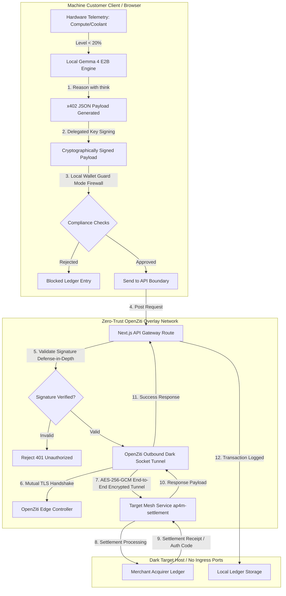

# Zero-Trust Machine Customer 🤖🔒

This repository contains a production-grade Proof of Concept (PoC) for an autonomous transactional ecosystem based on **Machine-to-Machine (M2M)** payments and Zero-Trust network architectures. 

The application simulates edge-native autonomous procurement. An edge AI agent (Gemma 4 E2B) monitors hardware telemetry levels, makes procurement decisions, constructs and cryptographically signs **Mastercard AP4M (x402 protocol)** payment payloads, subjects them to a local **Wallet Guard Mode** compliance firewall, and transmits them over a software-defined **OpenZiti** Zero-Trust overlay network.

---

## 🚀 Architectural Blueprint

The application is built on **Next.js 16 (App Router)** and utilizes an offline-first resilient architecture. Below is the transaction lifecycle flow:


```mermaid
graph TD
    subgraph Client [Machine Customer Client / Browser]
        A[Hardware Telemetry: Compute/Coolant] -->|Level < 20%| B[Local Gemma 4 E2B Engine]
        B -->|1. Reason with think| C[x402 JSON Payload Generated]
        C -->|2. Delegated Key Signing| D[Cryptographically Signed Payload]
        D -->|3. Local Wallet Guard Mode Firewall| E{Compliance Checks}
        E -->|Rejected| F[Blocked Ledger Entry]
        E -->|Approved| G[Send to API Boundary]
    end
    subgraph Edge_Mesh [Zero-Trust OpenZiti Overlay Network]
        G -->|4. Post Request| H[Next.js API Gateway Route]
        H -->|5. Validate Signature Defense-in-Depth| I{Signature Verified?}
        I -->|Invalid| J[Reject 401 Unauthorized]
        I -->|Valid| K[OpenZiti Outbound Dark Socket Tunnel]
        K -->|6. Mutual TLS Handshake| L[OpenZiti Edge Controller]
        K -->|7. AES-256-GCM End-to-End Encrypted Tunnel| M[Target Mesh Service ap4m-settlement]
    end
    subgraph Acquirer_Server [Dark Target Host / No Ingress Ports]
        M -->|8. Settlement Processing| N[Merchant Acquirer Ledger]
        N -->|9. Settlement Receipt / Auth Code| M
        M -->|10. Response Payload| K
        K -->|11. Success Response| H
        H -->|12. Transaction Logged| O[Local Ledger Storage]
    end
```

### Flow Execution Breakdown:
1. **Hardware Telemetry Monitor**: Operation resources (cloud compute cores and coolant fluid) steadily deplete over time.
2. **AI Decision Engine (Gemma 4 E2B)**: When resources hit a critical threshold (< 20%), a local LLM prompt is executed. Using structured reasoning chain thoughts (`<|think|>`), it determines the optimal replenishment amount and creates the purchase JSON payload.
3. **Wallet Guard Mode Firewall**: The payload is intercepted and evaluated against daily spending limits and allowed vendor rules (similar to delegated agent wallets like MetaMask Agent Wallet).
4. **Zero-Trust Secure Transit (OpenZiti)**: Approved transactions are posted to the Next.js backend, which initializes an outbound cryptographically secured mTLS session with the OpenZiti network. It resolves the dark target service `ap4m-settlement-service` with no inbound open ports on the host firewalls, preventing key leaks and network scanners.

---

## ✨ Core Innovations

* **Local AI Execution & Reasoning**: Visualizes the prompt config injected to Gemma E2B alongside a real-time logical reasoning terminal capturing `<|think|>` tokens.
* **x402 M2M Payment Protocol**: Encodes transactions in micro-cents (`ucents`) using Mastercard AP4M standard structures with RSA-2048 signing keys.
* **Resilient Offline Storage**: Uses robust serialization and safe parsing to prevent corrupted browser data from crashing the dashboard.
* **Race Condition Protection**: Employs synchronized queue locks to process concurrent transactions, protecting budgets from duplicate spend race conditions.
* **OpenZiti Overlay Topology**: Dynamic network status board visualizing PKI handshakes, mTLS status, and secure transmission events.
* **Cryptographic Ledger**: Complete audit ledger logs showing transaction hashes, authorization codes, and network transport details.

---

## 🏗️ Project Structure

```text
src/
├── app/
│   ├── api/transmit-ziti/    # OpenZiti client-server transit gateway route
│   ├── ledger/               # Ledger audit ledger dashboard page
│   ├── network/              # Overlay network routing topology page
│   ├── security/             # Security compliance & wallet key managers page
│   ├── globals.css           # Global Tailwind and visual tokens
│   ├── layout.tsx            # Main layout wrapper
│   └── page.tsx              # Simulator dashboard root entry point
├── components/
│   ├── layout/sidebar.tsx    # Responsive side navigation
│   ├── MachineCustomerSimulator.tsx # Autopilot simulator interface controller
│   └── ...
├── hooks/
│   └── use-simulation.tsx    # Simulation React Context orchestrating telemetry
└── lib/
    ├── agent_pay_protocol.ts # Mastercard AP4M x402 protocol and RSA signatures
    ├── AgentGuardMode.ts     # Local wallet compliance rules and limits
    ├── constants.ts          # Routes and approved supplier configurations
    └── ziti_server.ts        # OpenZiti Node.js SDK connector and fallback simulator
```

---

## ⚙️ Installation & Running

### Prerequisites
* **Node.js**: v20 or superior
* **npm**: v10 or superior

### Running Locally
1. Install project dependencies:
   ```bash
   npm install
   ```
2. Run development server:
   ```bash
   npm run dev
   ```
3. Open [http://localhost:3000](http://localhost:3000) in your web browser.

### Running Automated Test Suite
Run the full Vitest suite (including library unit tests, state management hooks integration tests, and API endpoint routing validation):
```bash
npm test
```

### Production Compilation
Build a optimized static application bundle:
```bash
npm run build
```

---

## 🛡️ Native OpenZiti Setup

By default, the application runs in a **High-Fidelity Simulation Mode** to provide interactive logs. To run transactions over a live OpenZiti overlay network:

1. Deploy a local OpenZiti controller and edge router (e.g., via Docker quickstart).
2. Register the machine customer client and the merchant endpoint identities, and map the `ap4m-settlement-service` routing.
3. Complete client enrollment and save the resulting identity configuration file to `ziti-identity.json`.
4. Place `ziti-identity.json` in the root folder of this project. The Next.js API route will automatically detect it and upgrade simulation traffic to native mTLS tunnels!
